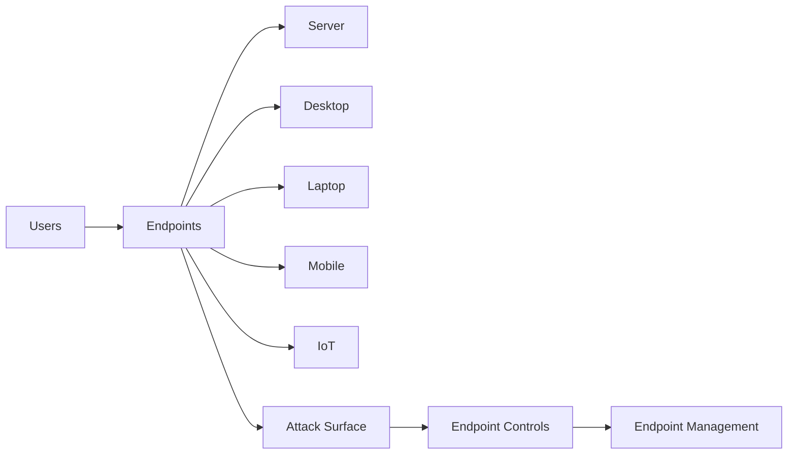

# Endpoint Security

> **Cybersecurity Architecture Series**  
> This wiki explains endpoint security in simple language: what endpoints are, how to manage them, and how BYOD programs should work.

## Big picture

Endpoint security protects the devices users use to reach your systems.  
It is a supporting layer for identity and access management.

## Why endpoint security matters

- A strong password or multi-factor authentication is not enough if the device itself is not trusted.
- Every device is another possible entry point for an attacker.
- Business and personal use are often mixed.
- Many operating systems and device types create complexity.
- Security needs **visibility** and **control** over endpoints.

## Wiki pages

| Page | What you will learn |
| --- | --- |
| [Endpoint Security](https://github.com/alishahbaz/Cybersecurity-Architecture-Endpoint-Security/wiki/Endpoint-Security) | What an endpoint is and why it matters |
| [Endpoint Management Systems](https://github.com/alishahbaz/Cybersecurity-Architecture-Endpoint-Security/wiki/Endpoint-Management-Systems) | Typical and best-practice endpoint management |
| [BYOD](https://github.com/alishahbaz/Cybersecurity-Architecture-Endpoint-Security/wiki/BYOD) | Bring Your Own Device programs and required controls |
| [Glossary](https://github.com/alishahbaz/Cybersecurity-Architecture-Endpoint-Security/wiki/Glossary) | Key terms |

## Core idea

> If you cannot see it and control it, you cannot secure it.
